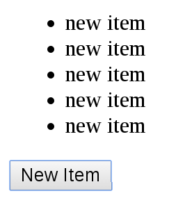

This demo helps you learn [Stupig architecture](https://github.com/licxpro/stupig). 
## What is stupig?

stupig, invented by licx, is an architecture pattern for building client-side web applications.

It is similar to MVC architecture, better than Flux's concept, and easier to learn.

 

## How to Play?

Install the demo.

```bash
$ git clone https://github.com/licxpro/stupig.git
$ cd stupig && npm install
$ npm start
```

Visit http://127.0.0.1:8080 with your browser.



You should see a button. Click it. That's all.

## Core Concepts

 
> - **Views**: the react
> - **Controller**:  the stupig framework controller
> - **Dispatcher**: a place receiving actions, and calling callbacks
> - **Stores**: a place managing the Application's state,

 

The key feature of the Stupig architecture is "one way" (unidirectional) data flow.

> 1. User interacts with Views
> 1. Views propagate an Action triggered by user
> 1. Dispatcher receives the Action and updates the Store
> 1. After action have been done Controoler update views
> 1. Views respond to the "change" event and update itself

Don't get it? Take it easy. I will give you the details soon.

## Demo Details

 
  
## License

Apache 2.0
